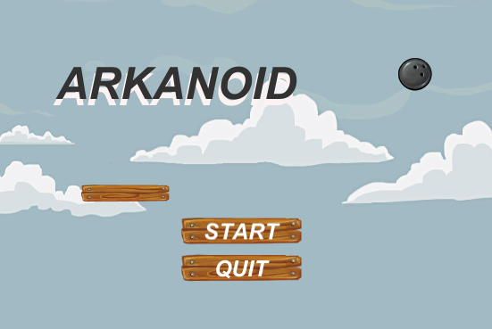
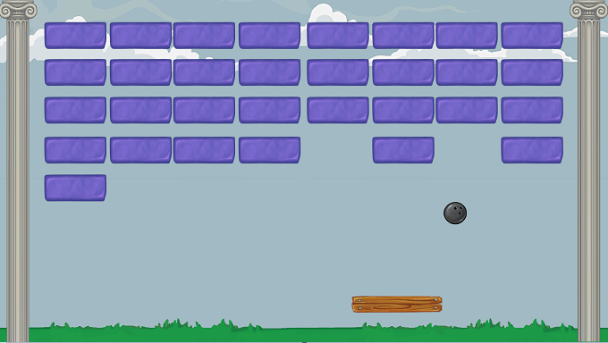

# Jogo-Arkanoid
Por: [***Francisco Henrique***](https://www.linkedin.com/in/francisco-henrique-010912189)

### -Projeto desenvolvido utilizando á *Game Engine* [Unity](https://unity.com/) com C#.

## Objetivo
- Apresentar e Orientar como funciona o Game Arkanoid, Projeto 2D.

### Gameplay
- O jogo possui apenas uma fase, seu objetivo é mover a plataforma para que a bola não chegue ao chão, toda vez que a bola colidir com um bloco ele será destruido, você ganha quando não ouverem mais blocos.

### Controles
* **Seta direcional Esquerda:** Move a plataforma para a esquerda.
* **Seta direcional Direita:** Move a plataforma para a direita.

## Para Executar:
* WEB: Na pasta Executável-WEB Rode o arquivo index.html e ele abrirá no seu navegador.
* PC: Na pasta Executável-PC rode o arquivo Arkanoid.exe e ele abrirá em sua máquina.
